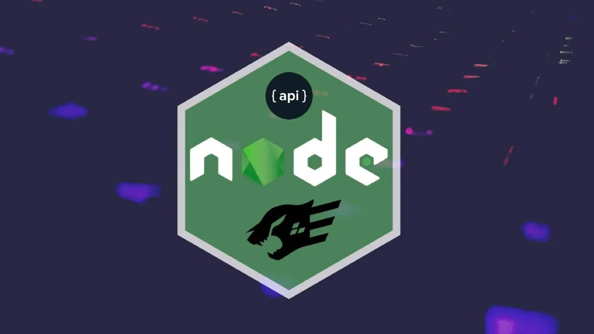

<h1 align="center">Transactions API 💱</h1>

  

 
<h2>🏦 Sobre</h2>

Serviço Web (API) para registrar transações financeiras de uma pessoa ou empresa.

 
<h2>🎯 Objetivo</h2>

Aplicar na prática os conhecimentos obtidos em algumas ferramentas que auxiliam a criação de uma API, como o Fastify para lidar com as requisições HTTP, o knex como Query Builder para manipular o banco de dados, Vitest para criar os testes das requisições, entre outras.

 
<h2>🛠️ Tecnologias e ferramentas/bibliotecas utilizadas</h2>
<ul>
  <li><a href="https://pt-br.reactjs.org/">NodeJS</a></li>
  <li><a href="https://www.typescriptlang.org/">Typescript</a></li>
  <li><a href="https://www.fastify.io/">Fastify</a></li>
  <li><a href="https://knexjs.org/">Knex</a></li>
  <li><a href="https://vitest.dev/">Vitest</a></li>
  <li><a href="https://github.com/colinhacks/zod">zod</a></li>
</ul>
 
<h2>💻 Como executar o projeto localmente </h2>
  <ol>
    <li>Faça fork ou baixe o projeto na sua máquina</li>
    <li>Abra o projeto em um editor de códigos, e execute o comando <strong>npm install</strong> no terminal, para baixar as dependências do projeto</li>
    <li>Rode o comando <strong>npm run dev</strong>, que irá subir o servidor localmente no seu computador, na porta 3333</li>
    <li>Pronto. O servidor já estará sendo executado no endereço http://localhost:3333.</li>
  </ol>
 
<h2>🚊 Rotas e métodos </h2>
  <ul>
    <li>Criar uma nova transação: <strong>Rota:</strong> /transactions | <strong>Método:</strong> PUT | <strong>Body da Requisição:</strong> title, amount e type</li>
    <li>Listar todas as transações de um usuário: <strong>Rota:</strong> /transactions | <strong>Método:</strong> GET </li>
    <li>Listar uma transação específica: <strong>Rota:</strong> /transactions/:id | <strong>Método:</strong> GET</li>
    <li>Buscar o resumo das transações (Diferença entre Entradas e Saídas): <strong>Rota:</strong> /transactions/summary | <strong>Método:</strong> GET</li>
  </ul>
 
<h2>📌 Funcionalidades a serem implementadas</h2>
<ul>
  <li>Criar uma rota para deletar uma transação (somente o usuário que criou a transação pode deleta-la) - Ok ✔️</li>
  <li>Criar uma rota para alterar uma transação (somente o usuário que criou a transação pode altera-la) - Ok ✔️</li>
</ul>
 
 

Made by Matheus Pazinati 🛸
